# FPGA-Based Image Capturing & Processing System

> **Department of Computer Engineering, University of Peradeniya**  
> E.M.M.U.B. Ekanayake (E/17/083) · W.A.C.J. Weerasinghe (E/19/423)  
> **Advisor:** Dr. Kamalanath Samarakoon, Senior Lecturer

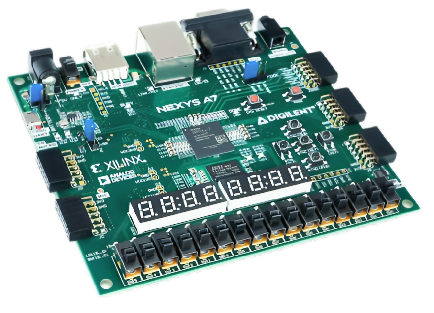

---

## Table of Contents

1. [Overview](#1-overview)
2. [Motivation](#2-motivation)
3. [System Architecture](#3-system-architecture)
4. [Filter Design](#4-filter-design)
5. [AXI Stream Protocol & Skid Buffer](#5-axi-stream-protocol--skid-buffer)
6. [UART ↔ AXIS Converter State Machines](#6-uart--axis-converter-state-machines)
7. [FPGA Implementation](#7-fpga-implementation)
8. [Host Python Script](#8-host-python-script)
9. [Simulation & Verification](#9-simulation--verification)
10. [Results](#10-results)
11. [Performance Analysis](#11-performance-analysis)
12. [Technology Stack](#12-technology-stack)
13. [Repository Structure](#13-repository-structure)
14. [Future Improvements](#14-future-improvements)
15. [Contributors](#15-contributors)

---

## 1. Overview

Traditional image processing runs sequentially on CPUs or GPUs — general-purpose processors bottlenecked by instruction fetch latency and limited parallelism. ASICs offer speed but cannot be reprogrammed. **FPGAs** are the optimal middle ground: massively parallel, low-latency, energy-efficient, and fully reconfigurable in the field.

This project implements a complete **hardware-accelerated image noise removal pipeline** on an Altera Cyclone IV FPGA. A Python host sends a grayscale image over UART, the FPGA applies a parallel hardware filter, and the processed image is returned to the host. Two filter algorithms are implemented in RTL: an **Averaging Filter** using an addition tree, and a **Median Filter** using bitonic sort — both exploiting FPGA spatial parallelism to compute results in nanoseconds.

**Key achievements:**
- Full RTL pipeline from UART RX → AXI Stream → Filter → AXI Stream → UART TX
- Two hardware filters implemented in SystemVerilog with parallel architectures
- AXI Stream (AXIS) protocol with proper backpressure handling via skid buffer
- Verified through ModelSim simulation with self-checking testbenches before hardware deployment
- Successfully deployed and tested on real hardware (Terasic DE2-115, Cyclone IV)
- Python + OpenCV host script for end-to-end image processing

---

## 2. Motivation

Image processing is critical across many domains:

| Domain | Application |
|---|---|
| Medical | MRI/X-ray enhancement, automated diagnosis support |
| Forensics | Image clarification, evidence restoration |
| Astronomy | Noise removal from long-exposure telescope captures |
| Agriculture | Crop disease detection from aerial/satellite imagery |
| Traffic Control | Vehicle detection and plate recognition |
| Archaeology | Digital restoration of damaged historical images |

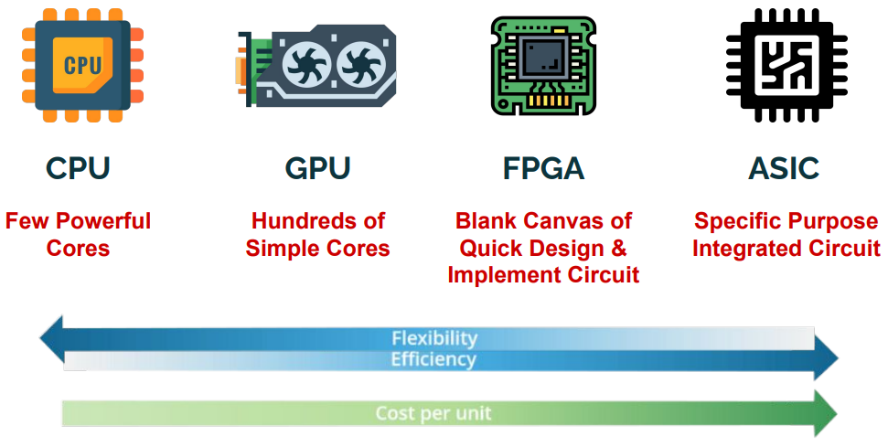

FPGAs are preferred over alternative hardware platforms for real-time image processing because of their unique combination:

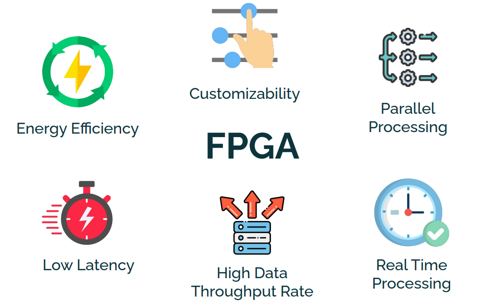

| Feature | CPU/GPU | ASIC | FPGA |
|---|---|---|---|
| Parallelism | Limited | Full | Full |
| Reprogrammability | ✅ | ❌ | ✅ |
| Latency | High (memory fetch) | Lowest | Very low |
| Power efficiency | Poor | Best | Good |
| Time to deploy | Fast | Slow (new fab) | Fast |

---

## 3. System Architecture

The system implements a streaming pipeline: image blocks travel from a Python host → FPGA over UART → pass through the AXI Stream pipeline → filter core → return to the host over UART.

### High-Level Data Flow

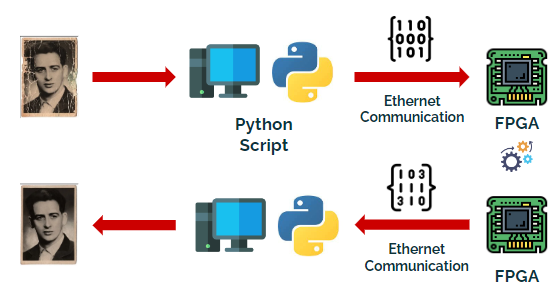

### System Block Diagram

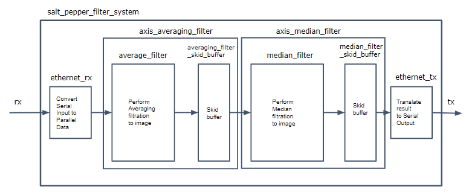

### Pipeline Overview

```
┌────────────────────────────────────────────────────────────────────────┐
│                            FPGA (Cyclone IV)                           │
│                                                                        │
│  ┌──────────────┐   AXIS   ┌─────────────┐   AXIS   ┌──────────────┐  │
│  │ UART → AXIS  │ ───────► │ Skid Buffer │ ───────► │    Filter    │  │
│  │  Converter   │          │             │          │  (Avg/Median)│  │
│  └──────────────┘          └─────────────┘          └──────┬───────┘  │
│         ▲                                                   │ AXIS     │
│         │ UART RX                                           ▼          │
│  ┌──────┴───────────────────────────────────────────────────────────┐  │
│  │                    AXIS → UART Converter                         │  │
│  └──────────────────────────────────────────────────────────────────┘  │
│         │ UART TX                                                       │
└─────────┼──────────────────────────────────────────────────────────────┘
          │
    ┌─────┴──────┐
    │  CH340 TTL │  USB ↔ UART bridge
    └─────┬──────┘
          │ USB
    ┌─────┴──────┐
    │  Python    │  Image send / receive / reconstruct
    │  Host PC   │
    └────────────┘
```

### Implementation Detail

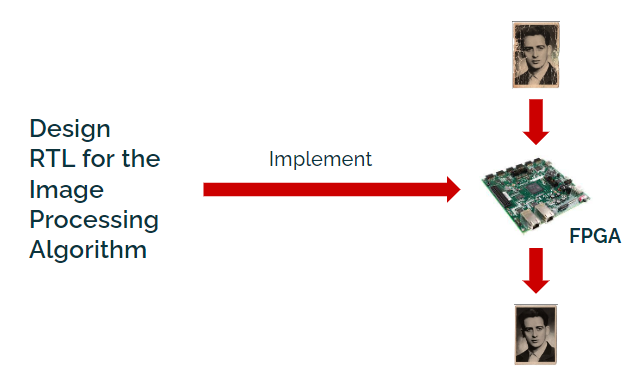

| Module | Language | Description |
|---|---|---|
| `UART → AXIS Converter` | SystemVerilog | Receives serial bytes, assembles into AXIS packets |
| `Skid Buffer` | SystemVerilog | 2-state FSM absorbing AXI backpressure |
| `Averaging Filter` | SystemVerilog | Parallel addition tree over 7×7 kernel |
| `Median Filter` | SystemVerilog | Bitonic sort network over 7×7 kernel |
| `AXIS → UART Converter` | SystemVerilog | Serialises AXIS packets back over UART |
| `fpga_module` (top) | Verilog | Top-level wrapper connecting all modules |

---

## 4. Filter Design

Both filters process image data in **7×7 pixel kernel blocks**, producing **5×5 output pixels** per invocation (the 1-pixel border around the kernel is used for neighbour access and trimmed from the output).

### 4.1 Averaging Filter — Addition Tree

**The problem with a naive approach:** Summing 49 pixels sequentially requires 48 adder stages, creating a deep critical path that limits clock frequency.

**The FPGA solution — Addition Tree:** A binary reduction network computes the sum in parallel stages:

```
Stage 1:  49 pixels → 25 partial sums  (24 additions in parallel)
Stage 2:  25 → 13 partial sums         (12 additions in parallel)
Stage 3:  13 → 7                        (6 additions in parallel)
Stage 4:   7 → 4                        (3 additions in parallel)
Stage 5:   4 → 2                        (2 additions in parallel)
Stage 6:   2 → 1 final sum             (1 addition)

Depth: ⌈log₂(49)⌉ = 6 stages  (vs. 48 sequential)
```

Each stage maps to a single level of parallel adders in LUT fabric. The entire sum is computed combinatorially — zero clock cycles of latency after the pipeline is filled.

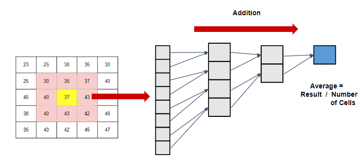

### 4.2 Median Filter — Bitonic Sort

**The problem with a naive approach:** Sorting 49 pixels with a sequential algorithm (e.g. bubble sort) requires O(N²) comparisons — completely unsuitable for hardware.

**The FPGA solution — Bitonic Sort:** A *sorting network* — a fixed topology of comparators where every comparison happens at a predetermined time and can be computed in parallel:

```
Network depth:   O(log²N) parallel stages
For N=49:        ≈ 30 parallel comparator stages
Each stage:      All comparators fire simultaneously in hardware
Result:          49 values sorted in fixed, predictable clock cycles
```

The median is then the 25th element (index 24) of the sorted array. Since the comparator graph is fixed at elaboration time, it maps directly into FPGA LUT layers with no control flow overhead.

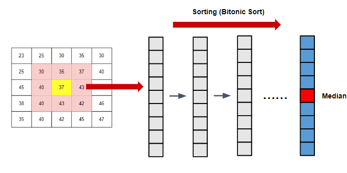

**Why Median beats Averaging for salt-and-pepper noise:**  
Salt-and-pepper noise creates extreme pixel values (0 or 255) randomly. Averaging pulls the mean towards these outliers, blurring edges. The median is statistically robust to outliers — a single extreme value in a 49-element set cannot move the median significantly — so edges are preserved while noise is rejected.

---

## 5. AXI Stream Protocol & Skid Buffer

### 5.1 AXI Stream Protocol

All inter-module data transfer uses the **AXI Stream (AXIS)** handshaking protocol — an ARM/AMBA industry standard for streaming data between IP blocks.

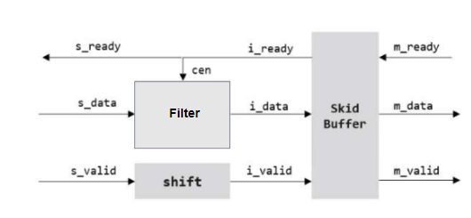

**Handshake rules:**
- `s_valid` — source asserts: "I have valid data on the bus"
- `m_ready` — destination asserts: "I am ready to accept data"
- A transfer occurs **only when both `s_valid` AND `m_ready` are high** on the same clock edge
- Neither side may assume the other is ready; both must tolerate arbitrary wait states

**Why this matters:** If the filter module is still computing and asserts `m_ready = 0`, the UART converter upstream must *stall*, not drop the byte. This is backpressure — and it must propagate cleanly without data loss.

### 5.2 Skid Buffer

A **skid buffer** is the minimal circuit that allows a pipelined source to tolerate one cycle of backpressure without stalling the upstream stage.

**State Machine (2 states):**

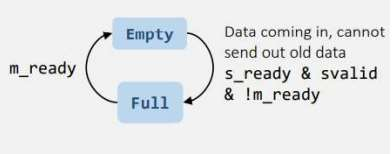

| State | Entry Condition | Behaviour |
|---|---|---|
| **EMPTY** | Reset, or `m_ready` re-asserted | Data passes directly from input to output register; `s_ready = 1` |
| **FULL** | `s_valid & s_ready & !m_ready` | Incoming data stored in buffer; `s_ready = 0` (stop accepting) |

**Transitions:**
- `EMPTY → FULL`: New data arrives (`s_valid`) but downstream is not ready (`!m_ready`) — store the data and de-assert `s_ready`
- `FULL → EMPTY`: Downstream becomes ready (`m_ready`) — release buffered data and re-assert `s_ready`

The skid buffer guarantees zero data loss across all backpressure scenarios with only 1 register of latency.

---

## 6. UART ↔ AXIS Converter State Machines

### 6.1 UART → AXIS Converter

Receives a stream of serial UART bits, assembles them into 8-bit bytes, and issues them as AXIS packets upstream.

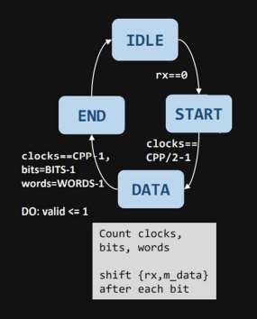

| State | Condition to Exit | Action |
|---|---|---|
| **IDLE** | `rx == 0` (start bit detected) | Begin sampling |
| **START** | `clocks == CPP/2 - 1` | Wait for mid-bit point to align sampling |
| **DATA** | `clocks == CPP-1, bits == BITS-1` | Sample bit, shift into `{rx, m_data}` each clock period |
| **END** | `words == WORDS-1` | Assert `valid <= 1`, output assembled word |

Where `CPP` = Clocks Per bit Period (derived from system clock ÷ baud rate), `BITS` = 8.

### 6.2 AXIS → UART Converter

Takes 8-bit AXIS packets and serialises them bit-by-bit onto the UART TX line.

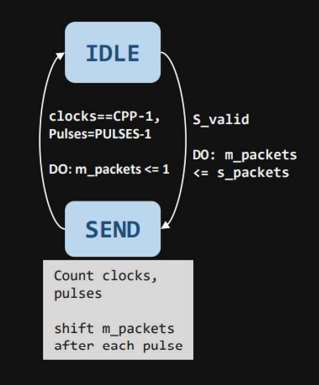

| State | Condition to Exit | Action |
|---|---|---|
| **IDLE** | `S_valid` asserted by upstream | Latch `s_packets <= m_packets`, begin transmission |
| **SEND** | `clocks == CPP-1, Pulses == PULSES-1` | Count clocks per bit period; shift `m_packets` right after each pulse |

The TX line outputs one bit per `CPP` clock cycles, LSB first, matching standard UART framing.

---

## 7. FPGA Implementation

### 7.1 Design Flow

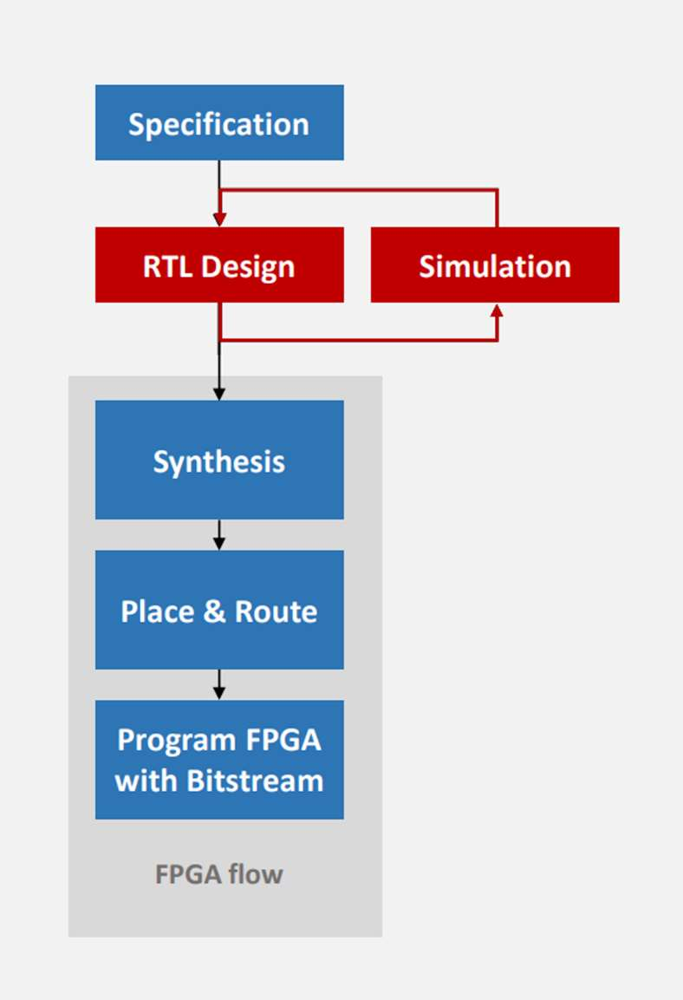

The complete FPGA development flow:

1. **Specification** — define module interfaces, timing, and protocol requirements
2. **RTL Design** — write synthesisable SystemVerilog for each module
3. **Simulation** — verify in ModelSim with self-checking testbenches (see §9); iterate if failures
4. **Synthesis** — Quartus Prime Lite maps RTL to Cyclone IV logic elements
5. **Place & Route** — Quartus assigns LEs to physical FPGA fabric locations and routes interconnects
6. **Program FPGA** — bitstream downloaded to DE2-115 via JTAG; device is live

### 7.2 Target Device

| Parameter | Value |
|---|---|
| Board | Altera Terasic DE2-115 |
| FPGA device | Cyclone IV EP4CE115F29C7N |
| Logic Elements | 114,480 LEs |
| Embedded memory | 3,888 kb |
| PLLs | 4 general-purpose |
| GPIO | 40 pins at 3.3V |
| Onboard oscillator | 50 MHz |

### 7.3 PLL Configuration

The Cyclone IV's onboard oscillator provides 50 MHz. A **Phase-Locked Loop (PLL)** is instantiated from the Quartus IP Catalog to generate a faster clock for the filter core:

- **Input clock:** 50 MHz (onboard)
- **Output clock:** 1000 MHz → fed into `fpga_module.sv` → distributed to filter pipeline
- Generated PLL Verilog file imported and instantiated in the top-level module

### 7.4 GPIO Pin Assignment & Hardware Wiring

The CH340 TTL converter translates between USB (PC) and 3.3V UART (FPGA GPIO).

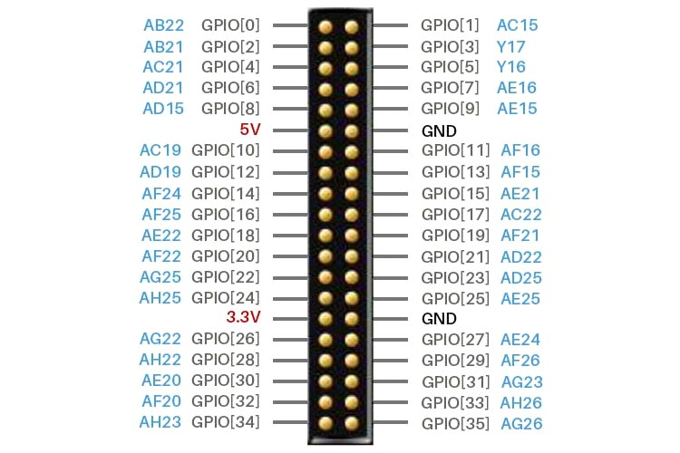

**Pin assignments (set via Quartus Pin Planner):**

| Signal | FPGA GPIO Pin | FPGA Ball | Connects To |
|---|---|---|---|
| `rx` (FPGA input) | GPIO[18] | AE22 | TTL Converter TX |
| `tx` (FPGA output) | GPIO[19] | AF21 | TTL Converter RX |

**Physical wiring:**
```
PC USB port ──► CH340 Module ──────────────────► FPGA GPIO Header
                    TX pin ──── Jumper wire ────► GPIO[18]  (rx)
                    RX pin ◄─── Jumper wire ────  GPIO[19]  (tx)
                   VCC pin ──── 3.3V             3.3V rail
                   GND pin ──── GND              GND
```

> The DE2-115 GPIO header exposes 3.3V logic. The CH340 operates at 3.3V. No level shifter is needed.

---

## 8. Host Python Script

The Python host manages the full image processing workflow — chunking, transmission, reception, and reconstruction.

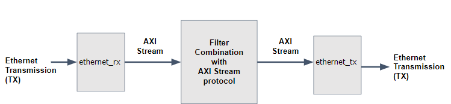

### Algorithm Step-by-Step

```
1. Read input image (OpenCV → NumPy grayscale array)
         │
         ▼
2. Block padding
   Image dimensions must be exactly divisible by 5 (output block size).
   Pad width and height with replicated edge pixels as needed.
         │
         ▼
3. Border padding
   Add 1-pixel border around the entire padded image.
   This gives the 7×7 kernel access to neighbours for all edge pixels.
         │
         ▼
4. Divide into 7×7 blocks
   n = (padded_width × padded_height) / 25
         │
         ▼
5. For each of the n blocks:
   ┌─────────────────────────────────────────┐
   │  a. Flatten 7×7 block → 49 bytes        │
   │  b. Send 49 bytes to FPGA over UART     │
   │  c. Receive 49 bytes back from FPGA     │
   │  d. Reshape received bytes → 7×7 array  │
   └─────────────────────────────────────────┘
         │
         ▼
6. Trim each 7×7 received block to the central 5×5 output region
         │
         ▼
7. Assemble all 5×5 blocks into full output image
         │
         ▼
8. Remove padding added in steps 2–3
         │
         ▼
9. Write output image (OpenCV)
```

### UART Communication Parameters

| Parameter | Value |
|---|---|
| Baud rate | 115,200 bps |
| Data bits | 8 |
| Stop bits | 1 |
| Parity | None |
| Bytes per block (TX) | 49 |
| Bytes per block (RX) | 49 |

### Libraries

| Library | Version | Role |
|---|---|---|
| OpenCV | 4.8.0 | Image read / write |
| NumPy | 1.21.0 | Pixel array slicing, padding, reshaping |
| PySerial | 3.5 | UART byte-level send and receive |
| Math | stdlib | Block count calculations |

---

## 9. Simulation & Verification

All modules were individually verified in **ModelSim** before hardware deployment. Testbenches generate random pixel data, compute expected outputs in software, and compare the RTL output cycle-by-cycle.

### 9.1 Median Filter Simulation

**Testbench methodology:**
- `img_data[6:...0][7:0]` — randomly generated 7×7 input pixel block
- `final_img_exp[6:...0][7:0]` — expected median-filtered output computed in the testbench
- `rx_data[48:0][7:0]` — actual output from the RTL pipeline (captured after full UART round-trip)
- **Pass condition:** `rx_data == final_img_exp` for all test vectors across all time steps

**Waveform — View 1** (42–54 μs window, steady-state transmission):

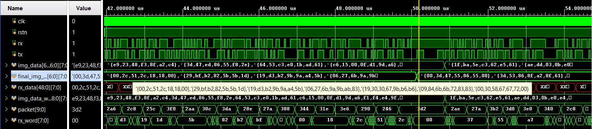

**Signal analysis:**
| Signal | Observation |
|---|---|
| `clk` | System clock — constant toggling |
| `rstn` | Active-high reset, deasserted — system running |
| `rx` / `tx` | UART serial lines — active toggling during transmission |
| `img_data[6:0][7:0]` | Input pixel groups being shifted in |
| `final_img_exp[6:0][7:0]` | Software-computed expected output |
| `rx_data[48:0][7:0]` | RTL filter output — **matches `final_img_exp` exactly** |
| `packet[9:0]` | UART packet counter, incrementing |
| `rx_word[7:0]` | Individual byte currently on the RX bus |

**Waveform — View 2** (cursor at 50.190451 μs — transition moment):

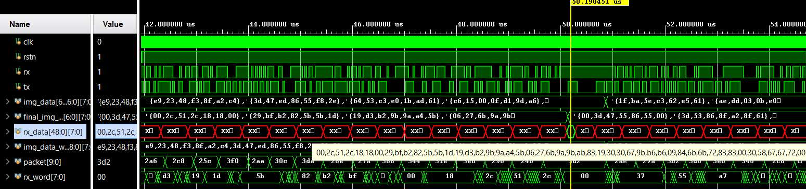

This view shows the cursor placed at a data transition, confirming the pipeline correctly propagates new input data through all stages (UART RX → AXIS → skid buffer → median filter → AXIS → UART TX) with no dropped or corrupted bytes. The `rx_data` bus updates in lock-step with `final_img_exp`.

### 9.2 Averaging Filter Simulation

**Waveform — View 1** (173–179 μs window, note nanosecond timescale vs. microseconds for median — averaging is faster):

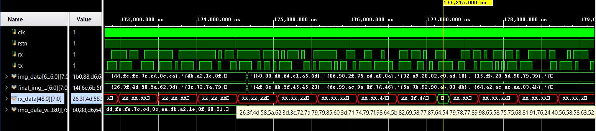

**Signal analysis:**
| Signal | Observation |
|---|---|
| `img_data[6:0][7:0]` | Input 7×7 pixel block |
| `final_img_exp[6:0][7:0]` | Software-computed average |
| `rx_data[48:0][7:0]` | RTL averaging filter output — **matches `final_img_exp` exactly** |
| `img_data_w..8:0][7:0]` | Windowed image data debug signal |

**Waveform — View 2** (cursor at 177,215.000 ns — mid-block transition):

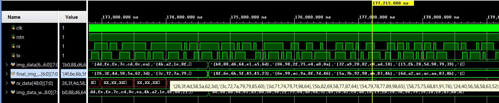

This view captures the moment the pipeline transitions from processing one image block to the next. `rx_data` correctly holds the previous block's averaged result while `img_data` begins loading the next block, with no pipeline stall visible — confirming the skid buffer and AXIS handshake are functioning correctly under sustained data flow.

### 9.3 Simulation Summary

| Filter | Test Vectors | Pass/Fail | Notes |
|---|---|---|---|
| Median | Full random sweep | ✅ PASS | `rx_data == final_img_exp` across all time steps |
| Averaging | Full random sweep | ✅ PASS | `rx_data == final_img_exp` across all time steps |

Both filters verified through the complete UART → AXIS → Skid → Filter → AXIS → UART pipeline before hardware deployment.

---

## 10. Results

### Test Image

Input: 430×320 px grayscale photograph with artificial salt-and-pepper noise applied.


### Median Filter Output


The median filter **effectively removes all visible salt-and-pepper noise** while preserving sharp edges throughout the image. The specular highlights on the metallic surface and fine structural edges remain crisp — a direct consequence of the median's statistical robustness to outliers. This is the expected behaviour for a non-linear order-statistic filter.

### Averaging Filter Output

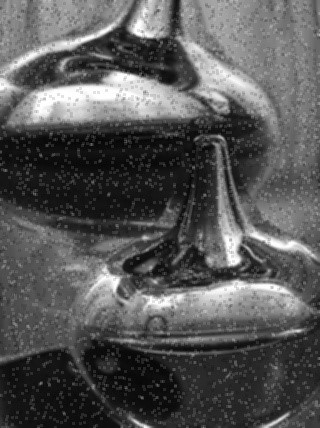

The averaging filter **partially reduces noise** but introduces visible blurring across edges. The metallic object's edges are softer, and residual noise remains visible as a fine grainy texture. This is the expected behaviour for a linear filter — it treats all pixels equally, so outlier noise values are attenuated but not eliminated, and high-frequency edge information is also smoothed away.

### Side-by-Side Comparison

| Criterion | Averaging Filter | Median Filter |
|---|---|---|
| Noise removal | Partial | Complete |
| Edge preservation | Poor (blurred) | Excellent (sharp) |
| Algorithm type | Linear | Non-linear |
| FPGA implementation | Addition tree | Bitonic sort |
| Suitable for salt & pepper noise | ❌ | ✅ |

---

## 11. Performance Analysis

### Theoretical Calculation

**Image:** 430 × 320 px = 137,600 total pixels

| Parameter | Calculation | Value |
|---|---|---|
| Pixels per input block | 7 × 7 | 49 pixels |
| Useful output pixels per block | 5 × 5 | 25 pixels |
| Total image blocks | 137,600 ÷ 25 | **5,504 blocks** |
| Bits TX per block | 49 pixels × 8 bits | 392 bits |
| Bits RX per block | 49 pixels × 8 bits | 392 bits |
| Total bits per round-trip | 392 + 392 | 784 bits |
| UART baud rate | — | 115,200 bps |
| Time per block | 784 ÷ 115,200 | **0.0068 s** |
| **Total calculated time** | 5,504 × 0.0068 | **37.43 s** |

> FPGA computation latency is nanoseconds — negligible and excluded from the above.

### Observed vs. Theoretical

| Metric | Value |
|---|---|
| Theoretical time | 37.43 s |
| **Measured time** | **44.23 s** |
| Discrepancy | +6.8 s (+18%) |

**Sources of overhead:**
- **UART framing bits:** Each byte includes start + stop bits (10 bits total per byte vs. 8 data bits assumed above) — accounts for ~+9.4 s theoretically unaccounted
- **OS serial driver latency:** Non-deterministic buffering in the PySerial/OS stack
- **FPGA backpressure events:** Skid buffer stalls when filter pipeline is momentarily full
- **Python overhead:** Array slicing, padding computation, and loop overhead between blocks

### Critical Bottleneck: UART, Not the FPGA

The FPGA filter computes a result in **nanoseconds**. Every second of the 44s total is moving data at 115,200 bps. This is a pure interface bottleneck, not a compute bottleneck.

| Interface | Bandwidth | Est. time for same image |
|---|---|---|
| **UART 115200** (current) | 115,200 bps | **~44 s** |
| USB 2.0 Full Speed | 12 Mbps | ~0.4 s |
| USB 2.0 High Speed | 480 Mbps | ~10 ms |
| Gigabit Ethernet (UDP) | ~900 Mbps | ~5 ms |
| USB 3.0 | 5 Gbps | < 1 ms |
| PCIe Gen3 x4 | 32 Gbps | < 0.1 ms |

Switching to Gigabit Ethernet alone would reduce processing time from 44 seconds to approximately 5 milliseconds — enabling true real-time processing.

---

## 12. Technology Stack

### Hardware

| Component | Specification | Cost (LKR) |
|---|---|---|
| FPGA Board | Altera Terasic DE2-115 (Cyclone IV EP4CE115F29C7N) | 252,520 |
| TTL Converter | CH340 USB-to-RS232/UART | 250 |
| Jumper Wires | Generic male-to-male (×2) | 20 |
| **Grand Total** | | **252,790** |

### HDL & EDA

| Tool / Language | Version/Standard | Purpose |
|---|---|---|
| SystemVerilog | IEEE 1800-2017 | RTL modules and verification testbenches |
| Verilog | IEEE 1364-2005 | Top-level wrapper (`fpga_module.v`) |
| Intel Quartus Prime Lite | 20.1.1 | Synthesis, Place & Route, bitstream generation |
| ModelSim | 20.1.1 | RTL simulation and waveform analysis |

> **Why both SystemVerilog and Verilog?**  
> SystemVerilog supports packed arrays (essential for the filter kernel data types) and class-based constructs for testbench verification. Verilog is used at the top level to avoid issues with multidimensional port connections when instantiating SystemVerilog sub-modules — a known toolchain compatibility consideration in Quartus.

### Host Software

| Library | Version | Purpose |
|---|---|---|
| Python | 3.12.0 | Host scripting and orchestration |
| OpenCV | 4.8.0 | Image file I/O and display |
| NumPy | 1.21.0 | Pixel array manipulation, padding, block assembly |
| PySerial | 3.5 | UART byte-stream communication |
| Math | stdlib | Block count and padding calculations |

---

## 13. Repository Structure

```
├── rtl/                        # All synthesisable RTL source files
│   ├── *.sv                    # SystemVerilog modules:
│   │                           #   averaging_filter.sv  — addition tree filter
│   │                           #   median_filter.sv     — bitonic sort filter
│   │                           #   uart_to_axis.sv      — UART RX → AXIS converter
│   │                           #   axis_to_uart.sv      — AXIS → UART TX converter
│   │                           #   skid_buffer.sv       — AXI backpressure buffer
│   └── *.v                     # Verilog top-level wrapper (fpga_module.v)
│
├── tb/                         # ModelSim simulation testbenches
│   └── *.sv                    # Self-checking testbenches per module
│
├── scripts/                    # Host-side Python
│   └── *.py                    # Image send/receive/reconstruct script
│
├── docs/
│   └── images/                 # All figures embedded in this README
│       ├── waveform_median_1.png       # Median filter ModelSim waveform (view 1)
│       ├── waveform_median_2.png       # Median filter ModelSim waveform (view 2)
│       ├── waveform_averaging_1.png    # Averaging filter ModelSim waveform (view 1)
│       ├── waveform_averaging_2.png    # Averaging filter ModelSim waveform (view 2)
│       ├── fsm_skid_buffer.png         # Skid buffer state machine diagram
│       ├── fsm_uart_to_axis.png        # UART→AXIS converter FSM
│       ├── fsm_axis_to_uart.png        # AXIS→UART converter FSM
│       ├── fpga_design_flow.png        # RTL→bitstream design flow chart
│       ├── gpio_pinout.png             # DE2-115 GPIO header pinout
│       ├── result_input_noisy.png      # Test input image (salt & pepper noise)
│       ├── result_median_output.png    # Median filter output
│       └── result_averaging_output.png # Averaging filter output
│
└── README.md
```

---

## 14. Future Improvements

- [ ] **Replace UART with Gigabit Ethernet** — reduce processing time from ~44s to ~5ms; enable true real-time operation
- [ ] **Add OV7670 camera module** — capture images directly into the FPGA without PC involvement; eliminate the host-to-FPGA transmission entirely for the input path
- [ ] **Extend to RGB colour images** — process each of R, G, B channels through an independent filter pipeline in parallel
- [ ] **Implement edge detection** — add Sobel and/or Canny filter modes in RTL as configurable pipeline stages
- [ ] **Stream pipelining** — chain multiple filter operations (e.g. noise removal → edge detect) without round-tripping data to the PC between stages
- [ ] **Port to Xilinx Vivado** — validate the design on the Artix-7/Zynq platform for broader accessibility

---

## 15. Contributors

| Name | Index | Contributions |
|---|---|---|
| E.M.M.U.B. Ekanayake | E/17/083 | RTL design, FPGA implementation, simulation & verification |
| W.A.C.J. Weerasinghe | E/19/423 | RTL design, Python host script, system integration |

**Advisor:** Dr. Kamalanath Samarakoon — Senior Lecturer, Department of Computer Engineering, University of Peradeniya

---

## Links

- [Department of Computer Engineering](http://www.ce.pdn.ac.lk/)
- [University of Peradeniya](https://eng.pdn.ac.lk/)

---

*Developed as part of CO227 — Computer Engineering Project, University of Peradeniya, Sri Lanka.*
